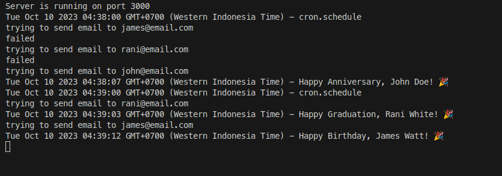

# Birthday Reminder (celebration-reminder-app)


To install dependencies:

```bash
bun install

or 

npm install
```

To run:

```bash
bun run server.js

or

node server.js
```

This project was created using `bun init` in bun v1.0.3. [Bun](https://bun.sh) is a fast all-in-one JavaScript runtime.

## Scheduler
This project uses cron for its job scheduler, located at the path: `services/cronService.js`
```js
async function initialize() {
    cron.schedule('0 9 * * *', async () => {
...        
```
By default the job is set at 9 o'clock.  
for testing it can be changed to * * * * *, so it runs every minute

## Database
For data it is located in the path `models/db.json`   
The data format is like this:
```json
{
  "users": [
    {
      "id": "1696750350176.116",
      "first_name": "John",
      "last_name": "Doe",
      "email": "john@email.com",
      "celebration_date": "1998-10-09",
      "celebration_type": "Anniversary",
      "last_date_sent": "2023-10-10T04:38:07+07:00",
      "timezone": "America/Los_Angeles"
    },
    {
      "id": "1696750350176.7385",
      "first_name": "James",
      "last_name": "Watt",
      "email": "james@email.com",
      "celebration_date": "2014-10-10",
      "celebration_type": "Birthday",
      "last_date_sent": "2023-10-10T04:39:12+07:00",
      "timezone": "Australia/Sydney"
    }
    ...
```
To do testing, set `last_date_sent` empty, so it will look like this
```json
{
  "users": [
    {
      "id": "1696750350176.116",
      "first_name": "John",
      "last_name": "Doe",
      "email": "john@email.com",
      "celebration_date": "1998-10-09",
      "celebration_type": "Anniversary",
      "last_date_sent": "",
      "timezone": "America/Los_Angeles"
    },
    ...
```
## Data User
To manage user data, such as listing, adding, changing or deleting, it is in the `routes/users.js`   
url address: `localhost:3000/user`

This application is made flexible, so it's not only for birthday greetings but also for other things, for example anniversaries.
in the json data, there is a `celebration_type` field which can be used as needed

```js
POST
//post body: json array
example:
[{    
    "first_name": "John",
    "last_name": "Doe",
    "email": "john@email.com",
    "celebration_date": "1998-10-09",
    "celebration_type": "Anniversary",  
    "timezone": "America/Los_Angeles"
  },
  {    
    "first_name": "James",
    "last_name": "Watt",
    "email": "james@email.com",
    "celebration_date": "2014-10-10",
    "celebration_type": "Birthday",    
    "timezone": "Australia/Sydney"
}]
```

```js
DELETE
/user/{:id}

example: 
/user/1696750350176.116
```

```js
PUT
// update user
// post body: json array

example
[{
    "id": "1696750350176.116",    
    "first_name": "John",
    "last_name": "Rock"
  },
  {
    "id": "1696750350176.7385",
    "first_name": "James",  
    "timezone": "Asia/Tokyo"
}]
```

```js
GET
// list user

example
[{
    "id": "1696750350176.116",
    "first_name": "John",
    "last_name": "Doe",
    "email": "john@email.com",
    "celebration_date": "1998-10-09",
    "celebration_type": "Anniversary",
    "last_date_sent": "",
    "timezone": "America/Los_Angeles"
}, {
    "id": "1696750350176.7385",
    "first_name": "James",
    "last_name": "Watt",
    "email": "james@email.com",
    "celebration_date": "2014-10-10",
    "celebration_type": "Birthday",
    "last_date_sent": "2023-10-10T03:16:24+07:00",
    "timezone": "Australia/Sydney"
}]
```


## Sample Testing


## Author
Ady Suwarjono   
`10 October 2023`